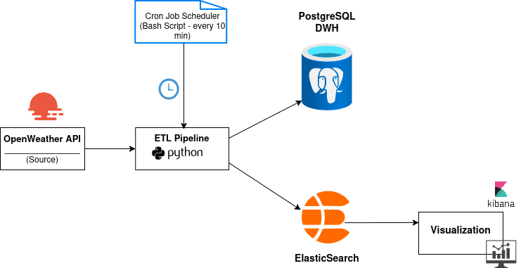
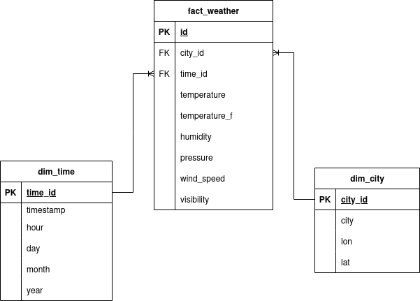
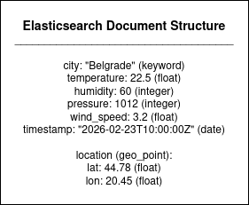
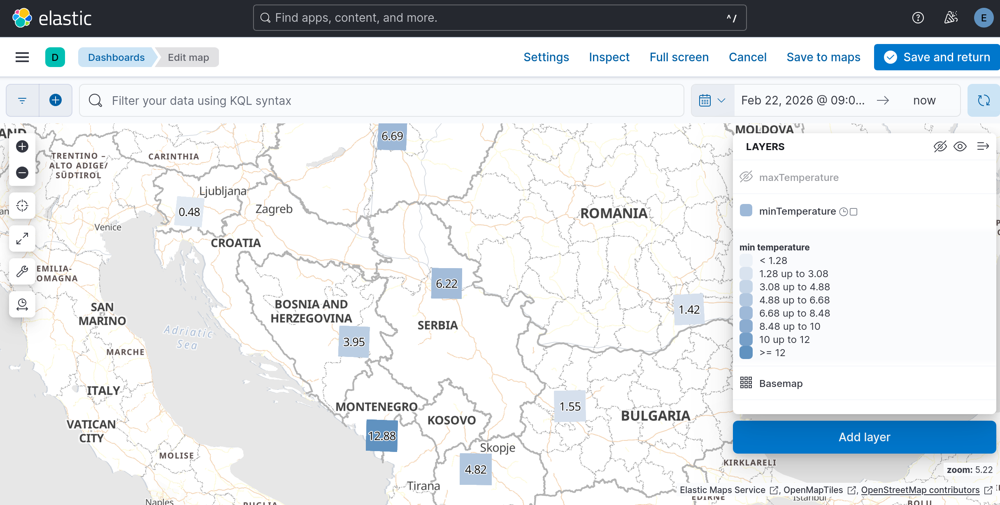
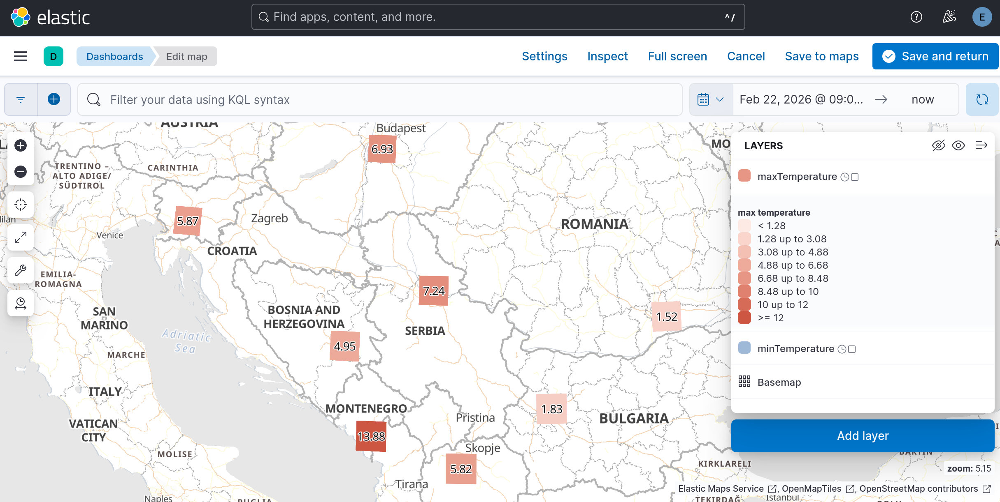
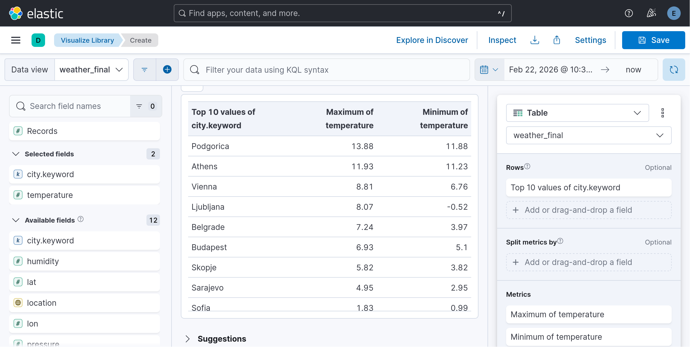
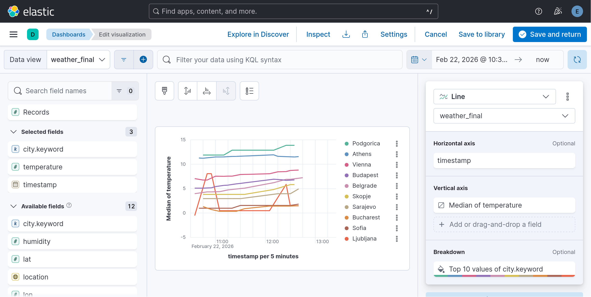
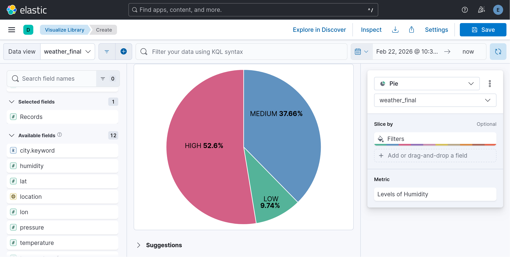
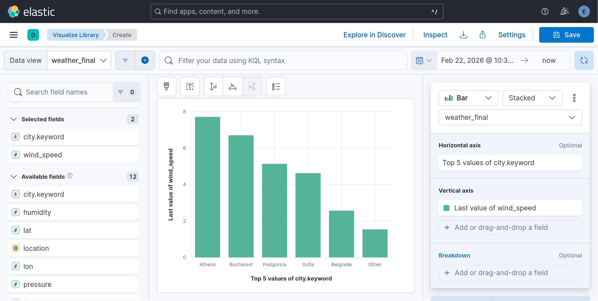

# weather-pipeline
## Overview
End-to-end weather data pipeline with Python, PostgreSQL, Elasticsearch, and Kibana for geospatial analytics and visualization.

## Architecure

## Technology Stack

**Programming Language:** Python
**Storage:** PostgreSQL (Data Warehouse), Elasticsearch
**Orchestration:** Cron, Bash
**Visualization:** Kibana

## Data Models

### Data Warehouse Model (Star Schema)

### Elastic Document Structure

## Final Dashboards & Screenshots

### Minimum & Maximum Temperature Analysis
This section presents temperature variations across cities using both geospatial and tabular visualizations.

- The **minimum temperature map** displays the lowest recorded temperatures for each city.

- The **maximum temperature map** shows the highest recorded temperatures using a separate layer.

- The **table view** provides a clear comparison of minimum and maximum temperatures for each city.

### Temperature Trends Over Time
This line chart visualizes temperature changes over time for multiple cities. Each city is represented by a different colored line, allowing easy comparison of temperature trends.

### Humidity Distribution
This pie chart shows the distribution of humidity levels across all records, categorized into three ranges: Low(0–60%), Medium(60–80%), High(80–100%).

### Top 5 Cities by Wind Speed
This bar chart displays the top 5 cities with the highest wind speeds based on the collected data.

